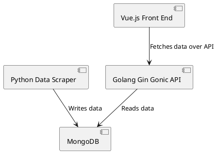

# Overview

### Components Overview

**Python DataScraper**  
- Utilises Python's BeautifulSoup module to scrape data directly from formula1.com.  
- Creates linked objects from the scraped data, with each object class containing a `getJsonRepr()` function used to populate the MongoDB.

**MongoDB**  
- Runs in a Docker container and contains collections to store data about races, seasons, and drivers.

**Golang API**  
- Processes data read from the database, decoding the data into structs. 
- Propagates theses structs thorugh multiple layers, eventually reaching the exposed API (using Gin Gonic), running on a dedicated port.

**Vue.js Front End**  
- Calls the exposed API endpoints and displays the provided data.  
- Heavily utilises Tailwind and PrimeVue for styling and UI components.

### Component Diagram
