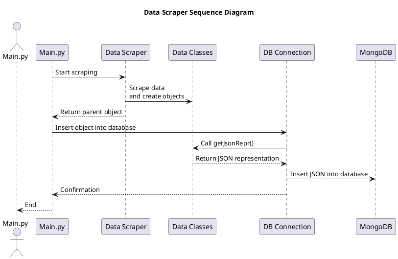

# Python Data Scraper

### Data Scraper Components
The datascarper consists of four seperate python packages.

* Data Classes
    - A collection of related classes
    - Each class provides a `getJsonRepr` method
* Data Scraper
    - Scrapes data direct from formula1.com
    - Creates objects in the Data Classes
* Database Connection
    - Establishes a connection to the MongoDB
    - Preforms the DB update operations
* Tools
    - Supports the other packages
    - Provides a standard logger

### Component Sequence Diagram

### Main.py Entry point
The datascraper is invoked by calling main.py  
This script accepts arguments to parse specfic races, specfic seasons (via a Json config) or season profiles.

